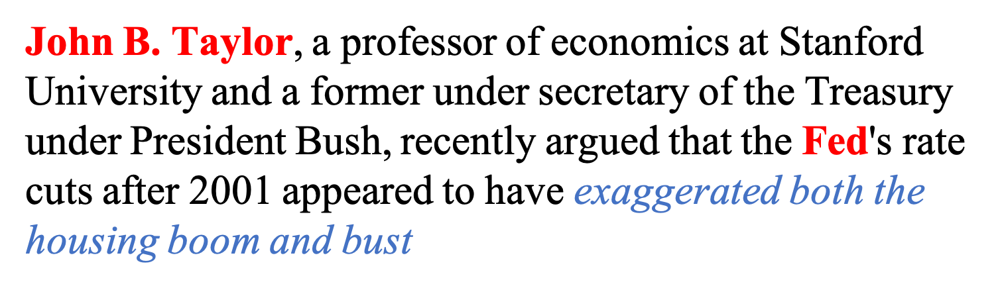
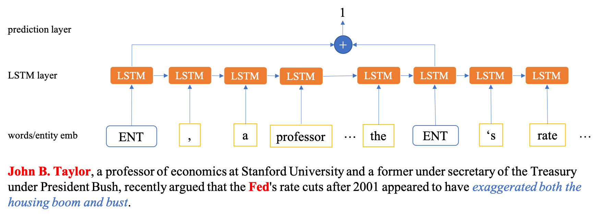

BlamePipeline
=============

Implementation of the AAAI 2019 paper: Who Blames Whom in a Crisis? Detecting Blame Ties from News Articles Using Neural Networks

### Task
Given a news article, extract blame ties (who blames whom) between entities in the article.

### Example

*An example sentence from our dataset containing a blame tie. The red/bold words are entities involved in a blame tie, and the blue/italic words are supporting evidence that the blame tie exists.*

### Models
Context Model

